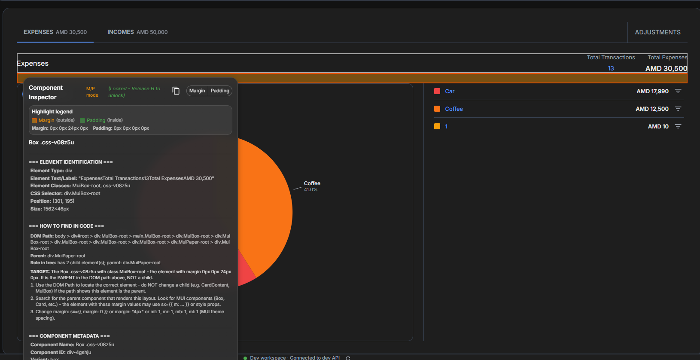

# React Component Inspector

> **A powerful development tool for inspecting React components with AI-friendly metadata extraction. Fully designed by Cursor AI.**

## 🎯 What is This?

React Component Inspector is a development-only tool that helps you identify, inspect, and extract detailed metadata from React components in your application. It's designed to work seamlessly with AI coding assistants (like Cursor) by providing structured, copyable metadata about any component in your UI.

## 🔍 What Problem Does It Solve?

### The Challenge
When working with AI assistants to fix or modify frontend code, you often need to:
- Identify which component is responsible for a specific UI element
- Understand the component's props, variants, and usage context
- Get the exact file path and component structure
- Extract CSS selectors and element identifiers for precise targeting

**Without this tool**, you'd need to:
- Manually inspect the DOM
- Search through codebases
- Guess component names and file locations
- Manually extract element information

### The Solution
React Component Inspector provides:
- **One-click component identification** - Hold CTRL and hover over any element
- **Margin, padding & gap inspection** - Hold CTRL+ALT to see spacing (margin, padding, flex/grid gap) and copy it for Cursor
- **Rich metadata extraction** - Component name, props, file path, usage context
- **AI-optimized format** - Copy-paste ready metadata for AI assistants (Component, Margin, Padding, Gap)
- **How to find in code** - Tooltip shows DOM path, target element, and step-by-step how to find and modify in Cursor
- **Zero production overhead** - Completely disabled in production builds

## 📊 What Data Does It Provide?

When you hold **CTRL** and hover over an element, a tooltip appears showing component metadata, copy buttons (Component / Margin / Padding / Gap), and the "How to find in code" section:



When you inspect a component, you get:

### Element Identification
- Element type (HTML tag)
- Element text/label content
- Element ID
- CSS classes
- CSS selector
- Position and size
- Role and accessibility attributes

### Component Metadata
- Component name
- Component ID (unique instance identifier)
- Variant (if applicable)
- Usage path (component hierarchy)
- Instance index
- Props signature (key props affecting behavior)
- Source file path

### Example Output (Copy Component)
```
=== TYPE: COMPONENT ===

=== ELEMENT IDENTIFICATION ===
Element Type: button
Element Text/Label: "Save Transaction"
...
DOM Path: body > div#root > div.MuiBox-root > button.MuiButton-root
Parent: div.MuiBox-root
Role in tree: leaf element; parent: div.MuiBox-root

=== TARGET (use this to instruct Cursor) ===
TARGET: The SaveButton with class MuiButton-root - position (450, 320), size 120x36px. It is the element in the DOM path above, NOT a child.

=== HOW TO FIND AND MODIFY THIS COMPONENT IN CODE ===
1. Use the DOM Path to locate the correct element...
2. Open src/components/buttons/SaveButton.tsx and find the component...
3. Modify the component's props, sx, or styles as needed.

=== COMPONENT METADATA ===
...
```

When you copy **Margin**, **Padding**, or **Gap**, you get the same structure with current values and instructions for changing that spacing in code (e.g. `sx={{ m: 1 }}`, `sx={{ p: 0.5 }}`, `sx={{ gap: 1 }}`).

## 🔎 How to Find and Modify in Cursor

The tooltip shows a **“How to find in code”** section (same on desktop and mobile):

- **DOM Path** – Full path from `body` to the element (e.g. `body > div#root > div.MuiBox-root > main.MuiBox-root > …`)
- **Parent** – Direct parent selector
- **Role in tree** – e.g. “has 3 child element(s); parent: div.MuiStack-root”
- **TARGET** – One-line description for Cursor: “The Card with class MuiPaper-root – the element with margin 0px 0px 16px 0px. It is the PARENT in the DOM path above, NOT a child.”
- **Steps** – Numbered steps: use DOM path, open source file, then how to change (margin, padding, gap, or component)

When you click **Copy Component**, **Copy Margin**, **Copy Padding**, or **Copy Gap**, the clipboard gets the full block (element identification, DOM path, TARGET, and “How to find and modify in code”). Paste that into Cursor and ask it to change the component, margin, padding, or gap; the text is written so Cursor can locate the right element and apply the change.

## 🚀 How to Use This Data for AI-Powered Frontend Optimization

### 1. **Precise Component Targeting**
Copy the metadata and ask your AI assistant:
```
"I need to modify the SaveButton component. Here's the metadata:
[paste metadata]

Change the button color to green and add an icon."
```

### 2. **Context-Aware Refactoring**
The usage path tells you exactly where the component is used:
```
"Refactor the TransactionCard component used in:
ActivityPage > TransactionList > TransactionCard

Make it accept a new 'priority' prop."
```

### 3. **CSS Selector Generation**
Use the CSS selector for automated testing or styling:
```javascript
// The metadata provides: button#save-button
const saveButton = document.querySelector('button#save-button');
```

### 4. **Component Discovery**
Find all instances of a component:
```
"Find all instances of TransactionCard in the codebase.
The component is defined in: src/components/transactions/TransactionCard.tsx"
```

### 5. **AI-Powered Debugging**
Share component metadata with AI to debug issues:
```
"This button isn't working. Component metadata:
[paste metadata]

The onClick handler should be in: src/components/buttons/SaveButton.tsx"
```

## 📦 Installation

```bash
npm install react-component-inspector
```

## 🔧 Setup

### 1. Wrap Your App

```tsx
import { InspectionProvider } from 'react-component-inspector';
import { InspectionTooltip } from 'react-component-inspector';
import { InspectionHighlight } from 'react-component-inspector';
import { setupInterceptors } from 'react-component-inspector';

function App() {
  // Setup request interceptors (optional - blocks API calls when CTRL is held)
  useEffect(() => {
    setupInterceptors();
  }, []);

  return (
    <InspectionProvider>
      <YourApp />
      <InspectionTooltip />
      <InspectionHighlight />
    </InspectionProvider>
  );
}
```

### 2. Add Metadata to Components

#### Option A: Using the Hook (Recommended)

```tsx
import { useInspectionMetadata } from 'react-component-inspector';

function MyButton({ variant, disabled, onClick }) {
  const inspectionProps = useInspectionMetadata({
    componentName: "MyButton",
    variant: variant,
    usagePath: "HomePage > ActionBar",
    props: { variant, disabled },
    sourceFile: "src/components/MyButton.tsx",
  });

  return (
    <button {...inspectionProps} onClick={onClick}>
      Click me
    </button>
  );
}
```

#### Option B: Using the Wrapper Component

```tsx
import { InspectionWrapper } from 'react-component-inspector';

function MyComponent({ variant, children }) {
  return (
    <InspectionWrapper
      componentName="MyComponent"
      variant={variant}
      usagePath="HomePage > ContentArea"
      props={{ variant }}
      sourceFile="src/components/MyComponent.tsx"
    >
      <div>{children}</div>
    </InspectionWrapper>
  );
}
```

#### Option C: Using Data Attributes (Manual)

```tsx
<div
  data-inspection-name="MyComponent"
  data-inspection-id="my-component-0"
  data-inspection-variant="primary"
  data-inspection-usage-path="HomePage > ContentArea"
  data-inspection-instance="0"
  data-inspection-props="variant=primary"
  data-inspection-file="src/components/MyComponent.tsx"
>
  Content
</div>
```

## 🎮 Usage

### Keyboard shortcuts (desktop)

| Shortcut | Action |
|----------|--------|
| **Hold CTRL** | Enter inspection mode. Hover to inspect component (box/element). |
| **Release CTRL** | Exit inspection mode and clear tooltip. |
| **Hold CTRL+ALT** | Enter margin/padding mode. See orange (margin), green (padding), purple (gap). |
| **CTRL+H** | Lock tooltip position so you can click copy buttons. |
| **CTRL+Shift+R** | Hard refresh (browser default; not captured by the inspector). |

### Basic flow

1. **Activate**: Hold `CTRL` (or `Cmd` on Mac)
2. **Inspect**: Hover over any element — tooltip shows component metadata and **How to find in code**
3. **Copy**: Use the copy icon (component) or **Margin** / **Padding** / **Gap** buttons to copy metadata to clipboard
4. **Lock** (optional): Press `CTRL+H` to lock the tooltip so it doesn’t follow the cursor
5. **Deactivate**: Release `CTRL` to exit inspection mode

### Margin, padding & gap inspection

- **Hold CTRL+ALT** (while holding CTRL) to enter margin/padding mode. Overlays show:
  - **Orange** = margin (outside the element)
  - **Green** = padding (inside the element)
  - **Purple dashed** = parent’s flex/grid gap (when the parent has `gap`)
- If the current element has no margin, **dashed orange** outlines show ancestors that have margin; **click an outline** to inspect that ancestor.
- Use the **Margin**, **Padding**, or **Gap** copy buttons in the tooltip to copy Cursor-ready text for that spacing.
- The tooltip always shows **DOM Path**, **Parent**, **Role in tree**, **TARGET**, and **How to find** steps so you (and Cursor) know exactly which element to change.

## 🛡️ Safety Features

- **Development Only**: Completely disabled in production (`NODE_ENV !== "development"`)
- **Request Blocking**: When CTRL is held, all API/Firebase requests are blocked to prevent accidental mutations
- **Zero Overhead**: No code included in production builds
- **Non-Intrusive**: Doesn't modify your components or affect their behavior

## 📚 Documentation

- [Quick Start Guide](./docs/QUICK_START.md)
- [API Reference](./docs/API.md)
- [Advanced Usage](./docs/ADVANCED.md)
- [AI Integration Guide](./docs/AI_INTEGRATION.md)

## 🎨 Features

- ✅ Visual component highlighting (box/element outline)
- ✅ **Margin, padding & gap inspection** (hold CTRL+ALT) with orange/green/purple overlays
- ✅ **Ancestor margin detection** – when the element has no margin, dashed outlines show ancestors with margin; click to inspect
- ✅ **Copy Component / Margin / Padding / Gap** – Cursor-ready text with DOM path, TARGET, and how to find in code
- ✅ **“How to find in code” in tooltip** – DOM path, parent, role in tree, TARGET, and numbered steps (desktop & mobile)
- ✅ Rich metadata extraction
- ✅ Automatic component detection (with or without `data-inspection-*`)
- ✅ CSS selector generation
- ✅ Usage path tracking
- ✅ Instance indexing
- ✅ Props signature extraction
- ✅ Request blocking during inspection (when CTRL is held)
- ✅ Production-safe (zero overhead)

## 🤖 Designed by Cursor AI

This tool was fully designed and developed using [Cursor](https://cursor.sh), an AI-powered code editor. The entire codebase, architecture, and documentation were created through AI-assisted development, demonstrating the power of AI in building developer tools.

## 📄 License

MIT

## 🤝 Contributing

Contributions are welcome! Please feel free to submit a Pull Request.

## ⚠️ Important Notes

- This tool is **development-only** and will not work in production
- Requires Material-UI (MUI) for the tooltip UI components
- Works best with TypeScript but supports JavaScript
- Request interceptors are optional but recommended for safety

## 💡 Tips for AI Integration

1. **Always copy the full metadata** - It contains all context needed
2. **Include the usage path** - Helps AI understand component hierarchy
3. **Share the source file** - Directs AI to the exact location
4. **Use CSS selectors** - For precise element targeting in AI prompts
5. **Copy element text** - Helps AI understand component purpose

---

**Made with ❤️ using Cursor AI**
